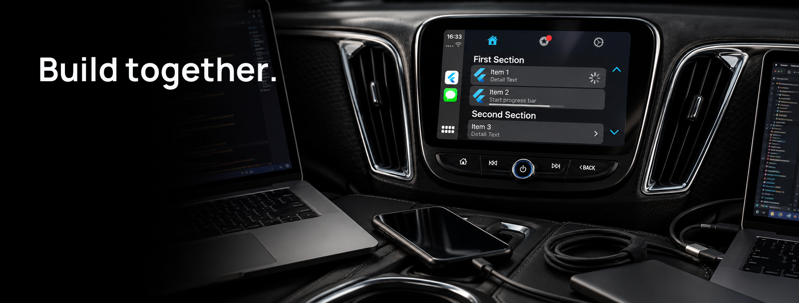

# Contributing



**Help bring more Flutter apps to CarPlay and Android Auto.**

`flutter_carplay` grows through focused fixes, thoughtful examples, native-host testing and careful reviews. You do not need to add a new template to make a valuable contribution: a reproducible report or a clearer setup step can help the next developer ship a better integration.

## Start with the problem

Check the [issue tracker](https://github.com/oguzhnatly/flutter_carplay/issues) before opening a report. Describe what you expected, what happened and the smallest example that reproduces it. Include the package version, Flutter version, phone OS, car host or simulator, and relevant app category.

For a new API or template, discuss the use case and native requirements first. Explain which platform supports it, where it belongs in the template hierarchy and how it behaves on older hosts. Keep unrelated improvements in separate pull requests.

Report vulnerabilities through the [security policy](SECURITY.md), not a public issue.

## Get the example running

Fork the repository and create a focused branch. Use Flutter 3.44 or later with Dart 3.12 or later, below Dart 4. Resolve both sets of dependencies:

```sh
flutter pub get
cd example
flutter pub get
flutter run
```

The phone app is the starting point. Use a CarPlay display or Android Auto Desktop Head Unit to check the native experience. Follow the README's category and entitlement guidance rather than assuming every example is available to every app.

## Keep the bridge dependable

Dart, Swift and Kotlin must agree on method names, field names, IDs, return types and event payloads. A public change should include an example, API documentation and regression coverage for the behavior it introduces.

Test rejected input and failed native operations as well as the happy path. Complete native method results exactly once. Handle disconnect, dismissal, cancellation and late asynchronous completion without reopening a session that has already ended.

Keep iOS sources in `ios/flutter_carplay/Sources/flutter_carplay`, which is shared by Swift Package Manager and CocoaPods. Check both integration paths when changing source placement or dependencies. Distinguish compiler SDK availability, runtime OS availability and the app's approved CarPlay category.

For Android Auto, distinguish Android OS API levels from Car App API levels. Respect host validation, template restrictions and fallback behavior. Keep optional speech providers, permissions and audio ownership in the application or example rather than adding them to the template package.

## Run the checks

From the repository root:

```sh
dart format lib test example/lib example/test
flutter analyze
flutter test
cd example
flutter analyze
flutter test
```

Build the native integrations affected by your change from the example directory:

```sh
flutter build ios --simulator --debug
flutter build apk --debug
```

Automated model and channel tests do not establish native presentation or vehicle audio routing. Exercise the affected template, navigation, callbacks, updates, dismissal and reconnect on its host. For visual changes, check light and dark appearance, long content, focused controls and different display sizes. For speech or media changes, also check permissions, interruption, cancellation and the actual input and output route.

## Make review straightforward

A good pull request explains the problem, the intended behavior and how to reproduce the result. Link the related issue, include relevant screenshots for visual changes and state the platform configuration actually checked.

Before submitting:

- [ ] The change is focused, with compatibility or breaking changes clearly described.
- [ ] Regression tests and the relevant automated checks pass.
- [ ] Affected native behavior has been exercised, or the missing check is explicitly identified.
- [ ] Examples, public API documentation, support notes and the changelog match the implementation.
- [ ] Credentials, personal recordings, generated builds and local diagnostic output are excluded.

Reviews are welcome too. Specific feedback about behavior, compatibility and native integration is especially useful.

## Join the conversation

Ask questions in [Discord](https://discord.gg/Xz6WVezFfh), coordinate a larger contribution at [info@oguzhanatalay.com](mailto:info@oguzhanatalay.com), or help review an [open pull request](https://github.com/oguzhnatly/flutter_carplay/pulls).

Thanks for helping improve `flutter_carplay`.
