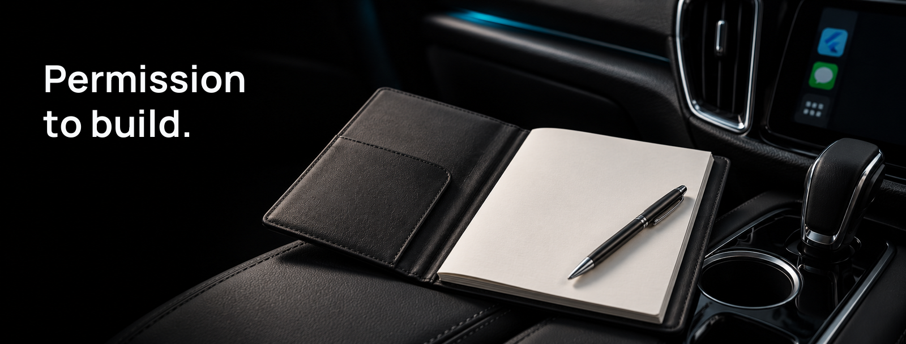

# MIT License



**Build with it. Adapt it. Make it part of your app.**

`flutter_carplay` uses the MIT license: a permissive license that allows personal, open-source and commercial use. The package can be part of a paid application without requiring that application to publish its source or adopt the MIT license solely because it uses this code.

## The essential requirement

Keep the copyright notice and permission notice in copies or substantial portions of the software. You may use, copy, modify, merge, publish, distribute, sublicense and sell the software under the terms below.

The software is provided without warranty. The legal text also limits the authors' liability. These permissions cover the package's code, not every third-party component, trademark or platform permission your application may need.

## Platform requirements still apply

Using this package does not grant a CarPlay entitlement, Android Auto distribution approval or rights to third-party branding. Choose the category approved for your application and follow Apple and Google requirements independently of the code license.

Platform marks identify the integration targets. This is an independent open-source package, not an Apple or Google endorsement. Other dependencies and assets retain their own terms.

## The complete license

Copyright (c) 2021 Oğuzhan Atalay.

The canonical [LICENSE](LICENSE) file is reproduced below without changing its terms. This introduction is an explanation, not an amendment.

```text
MIT License

Copyright (c) 2021 Oğuzhan Atalay

Permission is hereby granted, free of charge, to any person obtaining a copy
of this software and associated documentation files (the "Software"), to deal
in the Software without restriction, including without limitation the rights
to use, copy, modify, merge, publish, distribute, sublicense, and/or sell
copies of the Software, and to permit persons to whom the Software is
furnished to do so, subject to the following conditions:

The above copyright notice and this permission notice shall be included in all
copies or substantial portions of the Software.

THE SOFTWARE IS PROVIDED "AS IS", WITHOUT WARRANTY OF ANY KIND, EXPRESS OR
IMPLIED, INCLUDING BUT NOT LIMITED TO THE WARRANTIES OF MERCHANTABILITY,
FITNESS FOR A PARTICULAR PURPOSE AND NONINFRINGEMENT. IN NO EVENT SHALL THE
AUTHORS OR COPYRIGHT HOLDERS BE LIABLE FOR ANY CLAIM, DAMAGES OR OTHER
LIABILITY, WHETHER IN AN ACTION OF CONTRACT, TORT OR OTHERWISE, ARISING FROM,
OUT OF OR IN CONNECTION WITH THE SOFTWARE OR THE USE OR OTHER DEALINGS IN THE
SOFTWARE.
```
